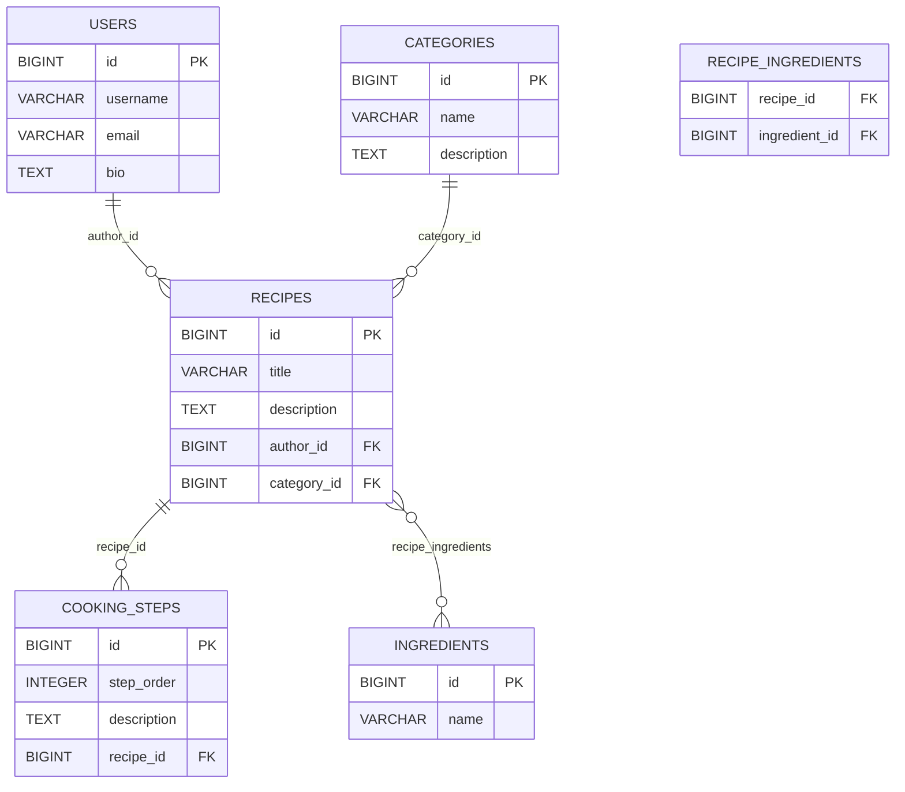

# Lab 2 Report: Recipe Sharing Platform

## What Is Implemented

The project now uses a real relational database through Spring Data JPA.

The main database is PostgreSQL and the application is configured for it in [application.properties](/D:/java/recipe-platform/src/main/resources/application.properties:1).

The data model contains 5 entities:

1. `User`
2. `Recipe`
3. `Category`
4. `Ingredient`
5. `CookingStep`

Implemented relationships:

1. `User` -> `Recipe`: `OneToMany` / `ManyToOne`
2. `Category` -> `Recipe`: `OneToMany` / `ManyToOne`
3. `Recipe` -> `CookingStep`: `OneToMany` / `ManyToOne`
4. `Recipe` <-> `Ingredient`: `ManyToMany`

## CRUD

Implemented REST CRUD endpoints:

1. Recipes: `GET/POST/PUT/DELETE /api/recipes`
2. Users: `GET/POST/PUT/DELETE /api/users`
3. Categories: `GET/POST/PUT/DELETE /api/categories`
4. Ingredients: `GET/POST/PUT/DELETE /api/ingredients`
5. Cooking steps: `GET/POST/PUT/DELETE /api/steps`

Extra endpoints:

1. Search recipes by title: `GET /api/recipes/search?title=...`
2. N+1 demo: `GET /api/lab/n-plus-one/problem`
3. N+1 solution with fetch join: `GET /api/lab/n-plus-one/solution`
4. Partial save without transaction: `POST /api/lab/transactions/without-transactional`
5. Full rollback with `@Transactional`: `POST /api/lab/transactions/with-transactional`

## CascadeType And FetchType

`FetchType.LAZY` is used for associations because recipe details should not always load the entire object graph automatically. This keeps default queries lighter and makes the N+1 problem visible for the lab demo.

`CascadeType.ALL` with `orphanRemoval = true` is configured only for `Recipe -> CookingStep`.

Reason:

1. A cooking step belongs to exactly one recipe.
2. A step has no independent lifecycle outside the recipe aggregate.
3. When a recipe is updated or deleted, its steps should be updated or deleted together with it.

No cascade is configured for `Recipe -> Ingredient`, `Recipe -> Category`, or `Recipe -> User`.

Reason:

1. Ingredients are shared by many recipes.
2. Categories are shared by many recipes.
3. Users are independent entities and should not be removed automatically when a recipe changes.

## N+1 Problem

The endpoint [LabController.java](/D:/java/recipe-platform/src/main/java/com/example/recipeplatform/controller/LabController.java:1) exposes two scenarios.

`/api/lab/n-plus-one/problem` loads recipes through the default `findAll()` query and then accesses lazy associations during DTO mapping. Because of this, Hibernate executes extra SQL statements for authors, categories, ingredients, and steps.

`/api/lab/n-plus-one/solution` uses `findAllWithDetails()` from [RecipeRepository.java](/D:/java/recipe-platform/src/main/java/com/example/recipeplatform/repository/RecipeRepository.java:1), where related entities are loaded with `fetch join`. The response includes the number of prepared SQL statements collected from Hibernate statistics, so the difference is visible directly in API output.

## Transaction Demo

The transaction demo is split into two cases:

1. [RecipeTransactionScenarioService.java](/D:/java/recipe-platform/src/main/java/com/example/recipeplatform/service/RecipeTransactionScenarioService.java:1) `saveWithoutTransactional(...)`
2. [RecipeTransactionScenarioService.java](/D:/java/recipe-platform/src/main/java/com/example/recipeplatform/service/RecipeTransactionScenarioService.java:1) `saveWithTransactional(...)`

Both methods create several related entities: `User`, `Category`, `Ingredient`, `Recipe`, and `CookingStep`, then throw an intentional exception.

Expected result:

1. Without `@Transactional`, part of the data remains in the database because each repository `save(...)` call is committed separately.
2. With `@Transactional`, the whole operation is rolled back and no related records remain.

The API response shows how many records with the generated marker were actually persisted.

## ER Diagram

## How To Run

1. Start the application with a JDK 21 environment.
2. Make sure PostgreSQL is running on `localhost:5432`.
3. Create the database `recipe_db` if it does not exist yet.
4. Run `./mvnw spring-boot:run` or start [RecipePlatformApplication.java](/D:/java/recipe-platform/src/main/java/com/example/recipeplatform/RecipePlatformApplication.java:1) from the IDE.
5. Default credentials are taken from [application.properties](/D:/java/recipe-platform/src/main/resources/application.properties:1), but they can also be overridden with `DB_URL`, `DB_USERNAME`, and `DB_PASSWORD`.
