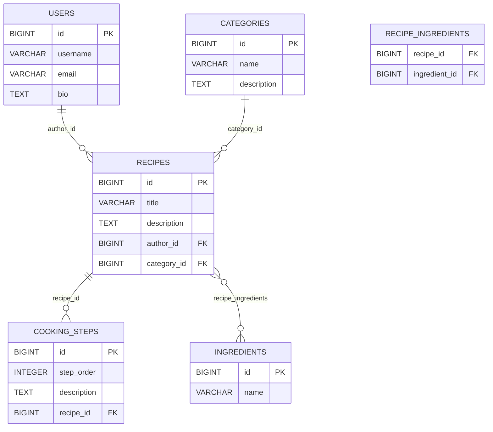

# Recipe Platform API

`Recipe Platform` — учебное REST API на Spring Boot для платформы обмена рецептами. Проект выполнен в рамках второй лабораторной работы и демонстрирует работу с реляционной базой данных, JPA-сущностями, CRUD-операциями, транзакциями и оптимизацией загрузки связанных данных.

## Соответствие требованиям лабораторной работы

1. Подключена реляционная БД `PostgreSQL`.
2. В модели данных реализовано 5 сущностей.
3. Реализованы CRUD-операции.
4. Настроены и обоснованы `CascadeType` и `FetchType`.
5. Продемонстрирована проблема `N+1` и её решение через `fetch join`.
6. Реализовано сохранение нескольких связанных сущностей с показом частичного сохранения без `@Transactional` и полного отката с `@Transactional`.
7. Добавлена ER-диаграмма с `PK/FK` и связями.

## Демонстрация проблемы N+1

Для лабораторной добавлены специальные эндпоинты:

* `http://localhost:8080/api/recipes/n-plus-one/problem
` — сценарий с проблемой `N+1`
* `http://localhost:8080/api/recipes/n-plus-one/solution` — сценарий с её решением через `fetch join`

В ответе возвращается количество SQL-запросов, чтобы можно было сравнить поведение до и после оптимизации.

## Демонстрация @Transactional

Для показа работы транзакций доступны два эндпоинта:

* `POST /api/lab/transactions/without-transactional`
* `POST /api/lab/transactions/with-transactional`

Что показывается:

* без `@Transactional` часть данных успевает сохраниться до возникновения ошибки;
* с `@Transactional` операция полностью откатывается.

## ER-диаграмма

## Запуск проекта

### Требования

Для запуска нужны:

* `JDK 21`
* `PostgreSQL`
* `Maven` или Maven Wrapper

### Настройки подключения

По умолчанию используются параметры:

* `DB_URL=jdbc:postgresql://localhost:5432/recipe_db`
* `DB_USERNAME=postgres`
* `DB_PASSWORD=07Omemeg`

Их можно оставить как есть или переопределить через переменные окружения.

## SonarCloud

[recipe-platform on SonarCloud](https://sonarcloud.io/project/overview?id=Ilzzllz_recipe-platform)
