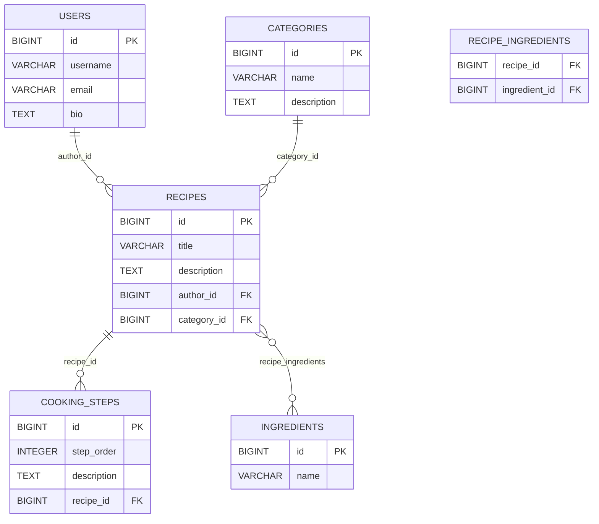

# Recipe Platform API

`Recipe Platform` — учебное REST API на Spring Boot для платформы обмена рецептами. Проект выполнен в рамках второй лабораторной работы и демонстрирует работу с реляционной базой данных, JPA-сущностями, CRUD-операциями, транзакциями и оптимизацией загрузки связанных данных.

## Соответствие требованиям лабораторной работы

1. Подключена реляционная БД `PostgreSQL`.
2. В модели данных реализовано 5 сущностей.
3. Реализованы CRUD-операции.
4. Настроены и обоснованы `CascadeType` и `FetchType`.
5. Продемонстрирована проблема `N+1` и её решение через `fetch join`.
6. Реализовано сохранение нескольких связанных сущностей с показом частичного сохранения без `@Transactional` и полного отката с `@Transactional`.
7. Добавлена ER-диаграмма с `PK/FK` и связями.

## Технологический стек

* `Java 21`
* `Spring Boot 3`
* `Spring Web`
* `Spring Data JPA`
* `PostgreSQL`
* `Lombok`
* `Maven`
* `JUnit 5`

## Архитектура проекта

Проект построен по многослойной архитектуре:

* `controller` — обработка HTTP-запросов.
* `service` — бизнес-логика и сценарии для демонстрации требований лабораторной.
* `repository` — доступ к данным через Spring Data JPA.
* `model` — сущности базы данных.
* `dto` — объекты передачи данных.
* `mapper` — преобразование сущностей в DTO.
* `exception` — централизованная обработка ошибок.

## Модель данных

В проекте используются сущности:

1. `User`
2. `Recipe`
3. `Category`
4. `Ingredient`
5. `CookingStep`

Реализованные связи:

* `User` -> `Recipe` — `OneToMany`
* `Category` -> `Recipe` — `OneToMany`
* `Recipe` -> `CookingStep` — `OneToMany`
* `Recipe` <-> `Ingredient` — `ManyToMany`

## Обоснование CascadeType и FetchType

Для ассоциаций в проекте по умолчанию используется `FetchType.LAZY`. Это позволяет:

* не загружать весь граф объектов без необходимости;
* уменьшить количество лишних данных в типичных запросах;
* наглядно показать проблему `N+1`.

Для связи `Recipe -> CookingStep` настроены `CascadeType.ALL` и `orphanRemoval = true`, потому что:

* шаги приготовления принадлежат только одному рецепту;
* шаг не имеет самостоятельного жизненного цикла вне рецепта;
* при обновлении или удалении рецепта связанные шаги должны меняться вместе с ним.

Для `User`, `Category` и `Ingredient` каскадное удаление не используется, потому что эти сущности независимы и могут использоваться в нескольких местах.

## CRUD API

### Рецепты

* `GET /api/recipes`
* `GET /api/recipes/{id}`
* `GET /api/recipes/search?title=...`
* `POST /api/recipes`
* `PUT /api/recipes/{id}`
* `DELETE /api/recipes/{id}`

### Пользователи

* `GET /api/users`
* `GET /api/users/{id}`
* `POST /api/users`
* `PUT /api/users/{id}`
* `DELETE /api/users/{id}`

### Категории

* `GET /api/categories`
* `GET /api/categories/{id}`
* `POST /api/categories`
* `PUT /api/categories/{id}`
* `DELETE /api/categories/{id}`

### Ингредиенты

* `GET /api/ingredients`
* `GET /api/ingredients/{id}`
* `POST /api/ingredients`
* `PUT /api/ingredients/{id}`
* `DELETE /api/ingredients/{id}`

### Шаги приготовления

* `GET /api/steps`
* `GET /api/steps/{id}`
* `POST /api/steps`
* `PUT /api/steps/{id}`
* `DELETE /api/steps/{id}`

## Демонстрация проблемы N+1

Для лабораторной добавлены специальные эндпоинты:

* `GET /api/lab/n-plus-one/problem` — сценарий с проблемой `N+1`
* `GET /api/lab/n-plus-one/solution` — сценарий с её решением через `fetch join`

В ответе возвращается количество SQL-запросов, чтобы можно было сравнить поведение до и после оптимизации.

## Демонстрация @Transactional

Для показа работы транзакций доступны два эндпоинта:

* `POST /api/lab/transactions/without-transactional`
* `POST /api/lab/transactions/with-transactional`

Что показывается:

* без `@Transactional` часть данных успевает сохраниться до возникновения ошибки;
* с `@Transactional` операция полностью откатывается.

## ER-диаграмма

## Запуск проекта

### Требования

Для запуска нужны:

* `JDK 21`
* `PostgreSQL`
* `Maven` или Maven Wrapper

### Настройки подключения

По умолчанию используются параметры:

* `DB_URL=jdbc:postgresql://localhost:5432/recipe_db`
* `DB_USERNAME=postgres`
* `DB_PASSWORD=07Omemeg`

Их можно оставить как есть или переопределить через переменные окружения.

## SonarCloud

[recipe-platform on SonarCloud](https://sonarcloud.io/project/overview?id=Ilzzllz_recipe-platform)
